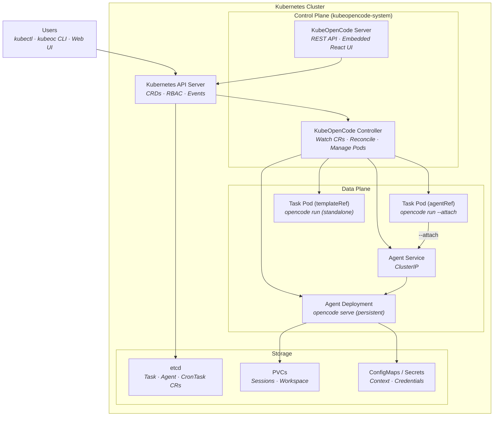
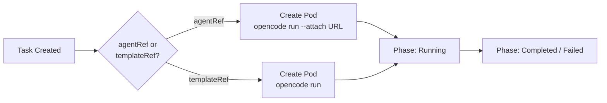
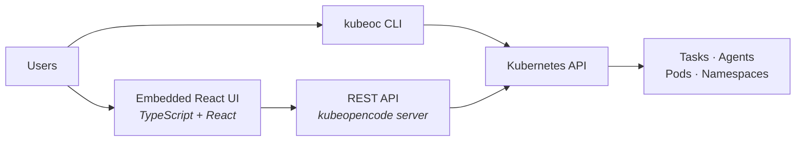

# Architecture & API Design

## System Overview

KubeOpenCode brings Agentic AI capabilities into the Kubernetes ecosystem. By leveraging Kubernetes, it enables AI agents to be deployed as services, run in isolated virtual environments, and integrate with enterprise management and governance frameworks.

### Core Goals

- Use Kubernetes CRDs to define Task and Agent resources
- Use Controller pattern to manage resource lifecycle
- Agents run as persistent Deployments; Tasks execute via lightweight attach Pods or ephemeral template Pods
- Seamless integration with Kubernetes ecosystem

### Key Advantages

- **Native Integration**: Works seamlessly with Helm, Kustomize, ArgoCD and other K8s tools
- **Declarative Management**: Use K8s resource definitions, supports GitOps
- **Infrastructure Reuse**: Logs, monitoring, auth/authz all leverage K8s capabilities
- **Simplified Operations**: Manage with standard K8s tools (kubectl, dashboard)
- **Batch Operations**: Use Helm/Kustomize to create multiple Tasks (Kubernetes-native approach)

### External Integrations

KubeOpenCode focuses on the core Task/Agent abstraction. For advanced features, integrate with external projects:

| Feature | Recommended Integration |
|---------|------------------------|
| Workflow orchestration | [Argo Workflows](https://argoproj.github.io/argo-workflows/) |
| Event-driven triggers | [Argo Events](https://argoproj.github.io/argo-events/) |
| Scheduled execution | [CronTask](features/crontask.md) (built-in) |

See the [kubeopencode/dogfooding](https://github.com/kubeopencode/dogfooding) repository for examples of GitHub webhook integration using Argo Events that creates KubeOpenCode Tasks.

---

## System Architecture



### Component Roles

| Component | Responsibility |
|-----------|----------------|
| **Controller** | Watches Task/Agent/CronTask CRs, creates Deployments/Pods/Services, manages lifecycle |
| **Server** | REST API + embedded React UI, proxies to Kubernetes API |
| **Agent Deployment** | Persistent `opencode serve` instance, handles multiple Tasks |
| **Task Pod (agentRef)** | Lightweight Pod that connects to Agent server via `--attach` |
| **Task Pod (templateRef)** | Standalone Pod with full environment, runs independently |

### Two-Container Pattern

Agent Deployments use a two-container pattern:

1. **Init Container** (`agentImage`): Copies OpenCode binary to `/tools` shared volume
2. **Worker Container** (`executorImage`): Runs `opencode serve` using `/tools/opencode`

### Image Resolution

| Field | Container | Default |
|-------|-----------|---------|
| `agentImage` | Init Container (OpenCode) | `ghcr.io/kubeopencode/kubeopencode-agent-opencode:latest` |
| `executorImage` | Worker Container (Server) | `ghcr.io/kubeopencode/kubeopencode-agent-devbox:latest` |
| `attachImage` | Task Pod (agentRef) | `ghcr.io/kubeopencode/kubeopencode-agent-attach:latest` |

### Task Execution Flow



---

## API Design

### Resource Overview

| Resource | Purpose | Stability |
|----------|---------|-----------|
| **Task** | Single task execution (primary API) | Stable |
| **CronTask** | Scheduled/recurring task execution | Stable |
| **Agent** | Running AI agent instance (Deployment + Service) | Stable |
| **AgentTemplate** | Reusable blueprint for Agents and ephemeral Tasks | Stable |
| **KubeOpenCodeConfig** | Cluster-scoped system-level configuration (singleton named `cluster`) | Stable |
| **Registry** | Enterprise agent catalog and marketplace (Alpha) | Alpha |

### Key Design Decisions

#### 1. Task as Primary API

Simple, focused API for single task execution. For batch operations, use Helm/Kustomize to create multiple Tasks.

#### 2. Agent (not KubeOpenCodeConfig)

- **Stable**: Independent of project name — won't change even if project renames
- **Semantic**: "Agent = AI + permissions + tools"

#### 3. No Batch/BatchRun

Kubernetes-native approach — use Helm, Kustomize, or other templating tools to create multiple Tasks. Reduces API complexity and leverages existing Kubernetes tooling.

#### 4. No Retry Mechanism

AI tasks are fundamentally different from traditional functions:

- **Non-deterministic output**: AI agents may produce different results on each run
- **Non-idempotent operations**: Tasks may perform actions (create PRs, modify files) that should not be repeated
- **Compound failures**: Retrying a partially completed task may cause duplicate operations

Pods are created with `RestartPolicy: Never`. If retry is needed, use [Argo Workflows](https://argoproj.github.io/argo-workflows/) or [Tekton Pipelines](https://tekton.dev/).

### Resource Hierarchy

```
Task (single task execution)
├── TaskSpec
│   ├── description: *string                (syntactic sugar for /workspace/task.md)
│   ├── contexts: []ContextItem             (inline context definitions)
│   ├── agentRef: *AgentReference           (Agent reference, same namespace)
│   ├── templateRef: *AgentTemplateReference (AgentTemplate reference, alternative to agentRef)
│   └── timeout: *metav1.Duration          (max execution duration, excludes queue time)
└── TaskExecutionStatus
    ├── observedGeneration: int64
    ├── phase: TaskPhase
    ├── agentRef: *AgentReference          (resolved Agent reference)
    ├── templateRef: *AgentTemplateReference (resolved template reference)
    ├── podName: string
    ├── session: *SessionInfo              (OpenCode session info)
    ├── startTime: *metav1.Time            (set when Task enters Running phase)
    ├── completionTime: *metav1.Time
    └── conditions: []metav1.Condition

Agent (running AI agent instance — always creates Deployment + Service)
└── AgentSpec
    ├── profile: string             (brief human-readable summary)
    ├── agentImage: string           (OpenCode init container image)
    ├── executorImage: string        (Main worker container image)
    ├── attachImage: string          (lightweight image for --attach Pods)
    ├── workspaceDir: string         (default: "/workspace")
    ├── command: []string
    ├── port: int32                  (OpenCode server port, default: 4096)
    ├── extraPorts: []ExtraPort      (additional Service/Deployment ports for DinD, VS Code, etc.)
    ├── persistence: *PersistenceConfig  (session/workspace PVCs)
    ├── suspend: bool                (scale Deployment to 0 replicas)
    ├── standby: *StandbyConfig      (automatic suspend/resume)
    ├── contexts: []ContextItem      (inline context definitions)
    ├── skills: []SkillSource        (external SKILL.md from Git repos)
    ├── plugins: []PluginSpec        (OpenCode plugins to load)
    ├── config: *runtime.RawExtension (inline OpenCode config, YAML object)
    ├── credentials: []Credential
    ├── caBundle: *CABundleConfig    (custom CA certificates for TLS)
    ├── proxy: *ProxyConfig          (HTTP/HTTPS proxy settings)
    ├── imagePullSecrets: []LocalObjectReference  (private registry auth)
    ├── podSpec: *AgentPodSpec
    ├── serviceAccountName: string
    ├── maxConcurrentTasks: *int32   (limit concurrent Tasks)
    ├── quota: *QuotaConfig          (rate limiting for Task starts)
    └── share: *ShareConfig          (shareable terminal link)

AgentTemplate (reusable blueprint for Agents and ephemeral Tasks)
└── AgentTemplateSpec
    ├── (shares most fields with AgentSpec)
    └── (except: profile, port, persistence, suspend, standby, share, templateRef)

CronTask (scheduled/recurring task execution)
└── CronTaskSpec
    ├── schedule: string             (cron expression)
    ├── timeZone: *string            (IANA timezone, default: UTC)
    ├── concurrencyPolicy: string    (Allow/Forbid/Replace, default: Forbid)
    ├── suspend: *bool
    ├── startingDeadlineSeconds: *int64
    ├── maxRetainedTasks: *int32     (default: 10)
    └── taskTemplate: TaskTemplateSpec

KubeOpenCodeConfig (system configuration, cluster-scoped singleton named "cluster")
└── KubeOpenCodeConfigSpec
    ├── systemImage: *SystemImageConfig
    ├── cleanup: *CleanupConfig
    ├── proxy: *ProxyConfig
    └── observability: *ObservabilitySpec
```

---

## Complete Type Definitions

```go
// Task represents a single task execution
type Task struct {
    Spec   TaskSpec
    Status TaskExecutionStatus
}

type TaskSpec struct {
    Description *string                 // Syntactic sugar for /workspace/task.md
    Contexts    []ContextItem           // Inline context definitions
    AgentRef    *AgentReference         // Agent reference (same namespace)
    TemplateRef *AgentTemplateReference // AgentTemplate reference (alternative to agentRef)
    // Exactly one of AgentRef or TemplateRef must be set
    Timeout     *metav1.Duration        // Max execution duration (from Running phase, excludes queue time)
}

// AgentReference references an Agent in the same namespace
type AgentReference struct {
    Name string // Agent name (required)
}

// ContextItem defines inline context content
type ContextItem struct {
    Name        string            // Optional identifier for logging, XML tags, deduplication
    Description string            // Human-readable documentation (no functional effect)
    Type        ContextType       // Text, ConfigMap, Git, Runtime, or URL
    MountPath   string            // Empty = write to .kubeopencode/context.md (ignored for Runtime)
    FileMode    *int32            // Optional file permission mode (e.g., 0755 for executable)
    Text        string            // Content when Type is Text
    ConfigMap   *ConfigMapContext // ConfigMap when Type is ConfigMap
    Git         *GitContext       // Git repo when Type is Git
    Runtime     *RuntimeContext   // Platform awareness when Type is Runtime
    URL         *URLContext       // Remote URL when Type is URL
}

type TaskExecutionStatus struct {
    ObservedGeneration int64
    Phase              TaskPhase
    AgentRef           *AgentReference          // Resolved Agent reference (agentRef Tasks only)
    TemplateRef        *AgentTemplateReference   // Resolved template reference (templateRef Tasks only)
    PodName            string
    Session            *SessionInfo             // OpenCode session info (agentRef Tasks only)
    StartTime          *metav1.Time
    CompletionTime     *metav1.Time
    Conditions         []metav1.Condition
}

type ContextType string
const (
    ContextTypeText      ContextType = "Text"
    ContextTypeConfigMap ContextType = "ConfigMap"
    ContextTypeGit       ContextType = "Git"
    ContextTypeRuntime   ContextType = "Runtime"
    ContextTypeURL       ContextType = "URL"
)

// Agent defines the AI agent configuration
type Agent struct {
    Spec AgentSpec
}

type AgentSpec struct {
    TemplateRef        *AgentTemplateReference
    Profile            string
    AgentImage         string
    ExecutorImage      string
    AttachImage        string
    WorkspaceDir       string
    Command            []string
    Contexts           []ContextItem
    Skills             []SkillSource
    Plugins            []PluginSpec              // OpenCode plugins to load
    Config             *runtime.RawExtension
    Credentials        []Credential
    PodSpec            *AgentPodSpec
    ServiceAccountName string
    MaxConcurrentTasks *int32
    Quota              *QuotaConfig
    CABundle           *CABundleConfig
    Proxy              *ProxyConfig
    ImagePullSecrets   []corev1.LocalObjectReference
    Port               int32
    ExtraPorts         []ExtraPort               // Additional Service/Deployment ports
    Persistence        *PersistenceConfig
    Suspend            bool
    Standby            *StandbyConfig
    Share              *ShareConfig
}

type SessionInfo struct {
    ID    string // OpenCode session ID
    URL   string // OpenCode session URL (for agentRef Tasks)
    Title string // Session title (set by OpenCode)
    Summary *SessionSummary // Token usage and cost summary (Phase 3)
}

type SessionSummary struct {
    MessageCount int64   // Total messages in the session
    TokenUsage   int64   // Total tokens consumed
    Cost         float64 // Estimated cost in USD
    FilesChanged int64   // Number of files modified
    Additions    int64   // Lines added
    Deletions    int64   // Lines removed
}

type InitContainerOverrides struct {
    ExtraEnv         []corev1.EnvVar      // Additional environment variables for this container
    ExtraVolumeMounts []corev1.VolumeMount // Additional volume mounts for this container
}

type SystemContainerOverrides struct {
    OpenCodeInit *InitContainerOverrides // Overrides for the opencode-init container (copies OpenCode binary)
    ContextInit  *InitContainerOverrides // Overrides for the context-init container (copies ConfigMap content)
    GitInit      *InitContainerOverrides // Overrides for ALL git-init-* containers (clones Git repos)
    GitSync      *InitContainerOverrides // Overrides for ALL git-sync-* sidecars (periodic Git sync)
    PluginInit   *InitContainerOverrides // Overrides for the plugin-init container (installs OpenCode plugins)
}

type AgentPodSpec struct {
    Labels              map[string]string           // Custom labels for the pod
    Annotations         map[string]string           // Custom annotations for the Deployment
    Scheduling          *PodScheduling              // Node selector, tolerations, and affinity
    RuntimeClassName    *string                     // Runtime class (e.g., "sysbox" for DinD)
    Resources           *corev1.ResourceRequirements // Container resource limits/requests
    SecurityContext     *corev1.SecurityContext      // Container-level security context
    PodSecurityContext  *corev1.PodSecurityContext   // Pod-level security context
    Lifecycle           *corev1.Lifecycle            // Container lifecycle hooks (e.g., postStart)
    ExtraVolumes        []corev1.Volume              // Additional volumes for the pod
    ExtraVolumeMounts   []corev1.VolumeMount         // Additional volume mounts (executor container)
    ExtraEnv            []corev1.EnvVar              // Additional env vars (all containers)
    SystemContainers    *SystemContainerOverrides   // Per-container-type overrides for system containers
}

type PodScheduling struct {
    NodeSelector map[string]string    // Node selection constraints
    Tolerations  []corev1.Toleration  // Pod tolerations
    Affinity     *corev1.Affinity     // Pod affinity/anti-affinity
}

type QuotaConfig struct {
    MaxTaskStarts  int32 // Maximum number of Task starts within the window
    WindowSeconds  int64 // Time window in seconds (default: 3600)
}

type ExtraPort struct {
    Name        string // Port name (DNS-label format)
    Port        int32  // Port number
    TargetPort  int32  // Target port on the container
    Protocol    string // TCP or UDP (default: TCP)
}

type ShareConfig struct {
    Enabled    bool          // Enable/disable the share link
    ExpiresAt  *metav1.Time  // Optional expiry time (link invalid after this)
    AllowedIPs []string      // Optional CIDR allowlist (empty = all IPs allowed)
}

type ShareStatus struct {
    SecretName string // Name of the Secret containing the share token
    URL        string // Full URL for the share link (/s/{token})
    Active     bool   // Whether the share link is currently active
}

type PersistenceConfig struct {
    Sessions  *VolumePersistence // Persist conversation history (OpenCode SQLite)
    Workspace *VolumePersistence  // Persist workspace files
}

type VolumePersistence struct {
    StorageClassName *string // StorageClass (default: cluster default)
    Size             string  // PVC size (e.g., "10Gi")
}

type StandbyConfig struct {
    IdleTimeout string // Duration after which to suspend (e.g., "30m", "1h")
}

type PluginSpec struct {
    Name    string             // Plugin name (e.g., "cc-safety-net" or "@scope/plugin-name")
    Options *runtime.RawExtension // Plugin-specific configuration options
}

type Credential struct {
    Name      string           // Credential identifier
    SecretRef *SecretReference // Reference to a Kubernetes Secret
    Env       string           // Environment variable name (for env injection)
    MountPath string           // File mount path inside container
    FileMode  *int32          // File permission mode (default: 0600)
}

type SecretReference struct {
    Name string // Secret name (in the same namespace)
    Key  string // Optional: specific key in Secret (default: all keys)
}

type CABundleConfig struct {
    ConfigMapRef *CABundleReference // CA bundle from ConfigMap (default key: "ca-bundle.crt")
    SecretRef    *CABundleReference // CA bundle from Secret (default key: "ca.crt")
}

type CABundleReference struct {
    Name string // ConfigMap/Secret name
    Key  string // Key within the ConfigMap/Secret
}

type ProxyConfig struct {
    HttpProxy  string // HTTP proxy URL (sets HTTP_PROXY and http_proxy)
    HttpsProxy string // HTTPS proxy URL (sets HTTPS_PROXY and https_proxy)
    NoProxy    string // Comma-separated bypass list (.svc,.cluster.local always appended)
}

type GitSync struct {
    Enabled  bool   // Enable auto-sync
    Interval string // Sync interval (e.g., "5m")
    Policy   string // HotReload or Rollout
}

type GitSyncStatus struct {
    Name       string      // Agent context name
    LastCommit string      // Last synced commit SHA
    LastSync   *metav1.Time // Last successful sync time
    Phase      string      // SyncPhase: Syncing, Ready, Error
    Message    string      // Status message or error
}

type TaskStartRecord struct {
    TaskName string       // Name of the Task
    TaskUID  types.UID    // UID of the Task
    StartTime *metav1.Time // When the Task started
}

// KubeOpenCodeConfig defines system-level configuration
type KubeOpenCodeConfig struct {
    Spec KubeOpenCodeConfigSpec
}

type KubeOpenCodeConfigSpec struct {
    ClusterDomain string             // Cluster domain for in-cluster URLs (default: "cluster.local")
    SystemImage   *SystemImageConfig
    Cleanup       *CleanupConfig
    Proxy         *ProxyConfig
    Observability *ObservabilitySpec // OpenTelemetry telemetry for agent Pods
}

type CleanupConfig struct {
    TTLSecondsAfterFinished *int32 // TTL for cleaning up finished Tasks (nil = disabled)
    MaxRetainedTasks        *int32 // Max completed Tasks to retain per namespace (nil = unlimited)
}
```

---

## KubeOpenCodeConfig (System Configuration)

KubeOpenCodeConfig provides **cluster-wide** settings for container image configuration and Task cleanup policies.

> **Note**: KubeOpenCodeConfig is a **cluster-scoped singleton** resource. Following OpenShift convention, it must be named `cluster`.

```yaml
apiVersion: kubeopencode.io/v1alpha1
kind: KubeOpenCodeConfig
metadata:
  name: cluster  # Required singleton name
spec:
  # System image for internal components (git-init, context-init)
  systemImage:
    image: ghcr.io/kubeopencode/kubeopencode:latest
    imagePullPolicy: Always  # Always/Never/IfNotPresent (default: IfNotPresent)

  # Task cleanup (optional)
  cleanup:
    ttlSecondsAfterFinished: 3600  # Delete finished Tasks after 1 hour
    maxRetainedTasks: 100          # Keep at most 100 per namespace

  # Cluster-wide proxy (Agent-level proxy overrides this)
  proxy:
    httpProxy: "http://proxy.corp.example.com:8080"
    httpsProxy: "http://proxy.corp.example.com:8080"
    noProxy: "localhost,127.0.0.1,10.0.0.0/8"

  # OpenTelemetry observability (optional)
  observability:
    openTelemetry:
      enabled: true
      endpoint: "http://otel-collector.observability:4318"
      enableLLMTraces: true
```

| Field | Type | Description |
|-------|------|-------------|
| `systemImage.image` | string | System image for internal components (default: built-in) |
| `systemImage.imagePullPolicy` | string | Pull policy: Always/Never/IfNotPresent (default: IfNotPresent) |
| `cleanup.ttlSecondsAfterFinished` | *int32 | TTL for finished Tasks. nil = disabled |
| `cleanup.maxRetainedTasks` | *int32 | Max completed Tasks per namespace. nil = unlimited |
| `proxy` | *ProxyConfig | Cluster-wide proxy. See [Enterprise](features/enterprise.md#httphttps-proxy-configuration) |
| `observability` | *ObservabilitySpec | OpenTelemetry telemetry for agent Pods. See [Observability](features/observability.md) |
| `clusterDomain` | string | Cluster domain name for in-cluster service URLs (default: "cluster.local") |

**Task Cleanup behavior:**
- **TTL-based**: Tasks deleted after `ttlSecondsAfterFinished` seconds from completion
- **Retention-based**: Only the most recent `maxRetainedTasks` completed Tasks retained per namespace
- **Combined**: Both can be used together. TTL checked first, then retention count
- **Cascading deletion**: Deleting a Task automatically deletes its associated Pod and ConfigMap
- Cleanup is disabled by default

---

## Web UI & REST API

KubeOpenCode includes a web-based UI for managing Tasks, Agents, and CronTasks.



**Key Design:**
- Single server binary (`kubeopencode server` subcommand)
- React UI embedded in Go binary via `embed` package
- ServiceAccount token authentication (Kubernetes RBAC)
- No external dependencies (no database)

### REST API Endpoints

| Method | Endpoint | Description |
|--------|----------|-------------|
| GET | `/api/v1/namespaces/{ns}/tasks` | List Tasks |
| GET | `/api/v1/namespaces/{ns}/tasks/{name}` | Get Task |
| POST | `/api/v1/namespaces/{ns}/tasks` | Create Task |
| DELETE | `/api/v1/namespaces/{ns}/tasks/{name}` | Delete Task |
| POST | `/api/v1/namespaces/{ns}/tasks/{name}/stop` | Stop Task |
| GET | `/api/v1/namespaces/{ns}/tasks/{name}/logs` | Stream logs (SSE) |
| GET | `/api/v1/agents` | List all Agents |
| GET | `/api/v1/namespaces/{ns}/agents` | List Agents in namespace |
| GET | `/api/v1/namespaces/{ns}/agents/{name}` | Get Agent details |
| POST | `/api/v1/namespaces/{ns}/agents/{name}/suspend` | Suspend Agent |
| POST | `/api/v1/namespaces/{ns}/agents/{name}/resume` | Resume Agent |
| GET | `/api/v1/namespaces/{ns}/crontasks` | List CronTasks |
| GET | `/api/v1/namespaces/{ns}/crontasks/{name}` | Get CronTask |
| POST | `/api/v1/namespaces/{ns}/crontasks/{name}/trigger` | Trigger CronTask |
| GET | `/api/v1/info` | Server info |
| GET | `/api/v1/namespaces` | List namespaces |

### Deployment

Enable the UI server in Helm:

```yaml
server:
  enabled: true
  replicas: 1
  service:
    type: ClusterIP
    port: 2746
```

Access via port-forward:

```bash
kubectl port-forward -n kubeopencode-system svc/kubeopencode-server 2746:2746
```

---

## kubectl Usage

```bash
# Task operations
kubectl apply -f task.yaml
kubectl get tasks -n kubeopencode-system
kubectl get task update-service-a -w
kubectl logs $(kubectl get task update-service-a -o jsonpath='{.status.podName}')
kubectl annotate task my-task kubeopencode.io/stop=true

# Agent operations
kubectl get agents -n kubeopencode-system
kubectl apply -f agent.yaml
kubectl get agent my-agent -o yaml

# CronTask operations
kubectl get crontasks -n kubeopencode-system
kubectl annotate crontask daily-scan kubeopencode.io/trigger=true

# Batch operations with Helm
helm template my-tasks ./chart | kubectl apply -f -
```

---

## Feature Reference

For detailed usage and configuration of each feature, see the [Features](features/index.md) section:

- [Live Agents](features/live-agents.md) — Persistent agents, interactive access, agent vs template tasks
- [Flexible Context System](features/context-system.md) — Text, ConfigMap, Git, Runtime, URL contexts
- [Agent Configuration](features/agent-configuration.md) — All Agent spec fields and configuration reference
- [Agent Templates](features/agent-templates.md) — Reusable blueprints, merge behavior
- [Skills](features/skills.md) — External SKILL.md from Git repos
- [Plugins](features/plugins.md) — OpenCode plugins for deep agent customization
- [CronTask](features/crontask.md) — Scheduled execution, concurrency policy
- [Concurrency & Quota](features/concurrency-quota.md) — Task limits, rate limiting
- [Persistence & Lifecycle](features/persistence.md) — PVCs, suspend/resume, standby
- [Enterprise](features/enterprise.md) — Proxy, CA certificates, private registry
- [Pod Configuration](features/pod-configuration.md) — Security context, scheduling, system containers
- [OpenTelemetry Observability](features/observability.md) — LLM call traces, token usage, and application-level spans
- [Task Timeout](features/task-timeout.md) — Automatic timeout for long-running tasks
- [Task Stop](features/task-stop.md) — Stop running tasks via annotation
- [Task Cleanup](features/task-cleanup.md) — Automatic cleanup of finished Tasks
- [Agent Share Link](features/share-link.md) — Share terminal access via URL
- [Git Auto-Sync](features/git-auto-sync.md) — Automatic sync with remote Git repositories
- [Multi-AI Support](features/multi-ai.md) — Use different agent images for various AI backends
