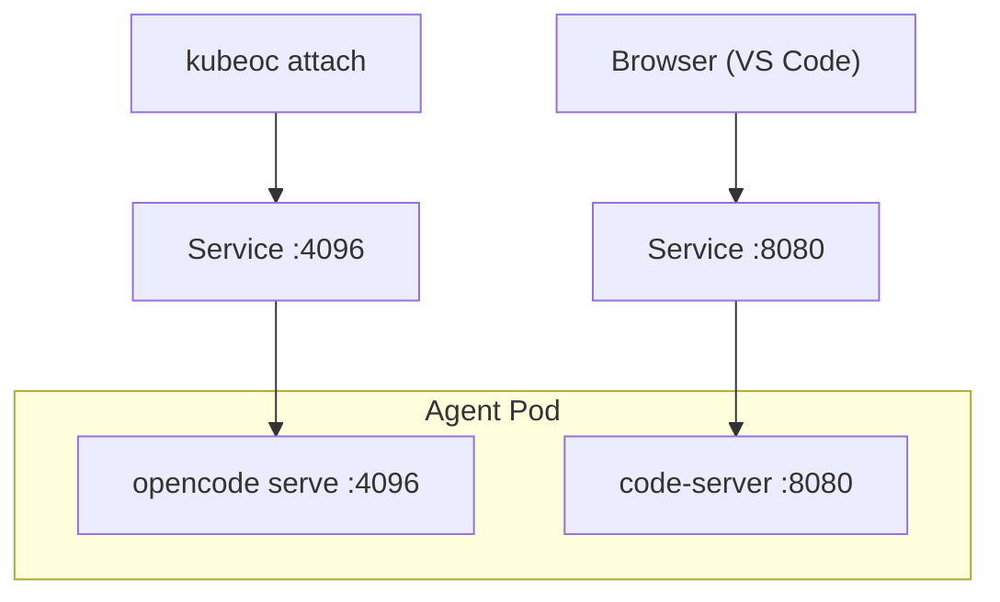

# VS Code in Browser

Run a full VS Code editor alongside your AI agent, accessible from any browser. This enables a powerful workflow where you can observe and interact with the agent's workspace in real-time — watching file changes, inspecting code, and making manual edits while the agent works.

## Overview

[code-server](https://github.com/coder/code-server) by Coder runs VS Code as a web application inside a container. Combined with KubeOpenCode's [extraPorts](../features/pod-configuration.md#extra-ports) feature, you can expose the VS Code UI through the Agent's Service and access it via `kubectl port-forward` or Ingress.



## Custom Executor Image

Create an executor image that extends devbox with code-server:

```dockerfile
FROM ghcr.io/kubeopencode/kubeopencode-agent-devbox:latest

USER root

# Install code-server
RUN curl -fsSL https://code-server.dev/install.sh | sh

# Create startup script
RUN cat > /usr/local/bin/start-code-server.sh << 'EOF'
#!/bin/bash
# Start code-server in background if not already running
if ! pgrep -x code-server > /dev/null 2>&1; then
    code-server \
        --bind-addr 0.0.0.0:8080 \
        --auth none \
        --disable-telemetry \
        --disable-workspace-trust \
        --user-data-dir /tmp/.vscode-server \
        &>/tmp/code-server.log &
    echo "code-server started on :8080" >&2
fi
EOF
RUN chmod +x /usr/local/bin/start-code-server.sh

# Ensure /tools is in PATH for all shell types so that the OpenCode binary
# (copied by the init container) is discoverable from VS Code's terminal.
# /etc/profile hardcodes PATH and overrides container env vars,
# so we must re-add /tools via profile.d (loaded after /etc/profile).
RUN echo 'export PATH="/tools:$PATH"' > /etc/profile.d/tools-path.sh && \
    echo 'export PATH="/tools:$PATH"' >> /etc/bash.bashrc && \
    echo 'export PATH="/tools:$PATH"' >> /etc/zsh/zshrc

# Auto-start code-server when interactive shells open.
# This covers shell subprocesses spawned by OpenCode tools.
RUN echo '/usr/local/bin/start-code-server.sh' >> /etc/bash.bashrc && \
    echo '/usr/local/bin/start-code-server.sh' >> /etc/zsh/zshrc

USER 1000:0
WORKDIR /workspace
CMD ["/bin/zsh"]
```

> **Note**: The `bashrc`/`zshrc` auto-start ensures code-server launches when OpenCode spawns an interactive shell (e.g., during the first Task). To start code-server immediately at Pod startup, use a `lifecycle.postStart` hook in the Agent configuration (see below).

Build and push:

```bash
docker build -t your-registry/devbox-vscode:latest .
docker push your-registry/devbox-vscode:latest
```

> **Note**: The `--auth none` flag disables password authentication. This is acceptable when access is restricted through Kubernetes RBAC and network policies. For environments where the Service is exposed externally, use `--auth password` with the `PASSWORD` environment variable set via a [credential](../features/agent-configuration.md).

## Agent Configuration

```yaml
apiVersion: kubeopencode.io/v1alpha1
kind: Agent
metadata:
  name: dev-agent
spec:
  profile: "Development agent with VS Code in browser"
  agentImage: ghcr.io/kubeopencode/kubeopencode-agent-opencode:latest
  executorImage: your-registry/devbox-vscode:latest
  workspaceDir: /workspace
  serviceAccountName: kubeopencode-agent
  port: 4096
  extraPorts:
    - name: vscode
      port: 8080
  podSpec:
    lifecycle:
      postStart:
        exec:
          command: ["/usr/local/bin/start-code-server.sh"]
```

The `lifecycle.postStart` hook starts code-server automatically when the Pod starts, running in parallel with the OpenCode server. This eliminates the need to manually `kubectl exec` the startup script or wait for the first Task to trigger it via `bashrc`.

> **Try it locally**: Ready-to-use examples are available in [`deploy/local-dev/`](https://github.com/kubeopencode/kubeopencode/tree/main/deploy/local-dev) — see [`Dockerfile.devbox-vscode`](https://github.com/kubeopencode/kubeopencode/blob/main/deploy/local-dev/Dockerfile.devbox-vscode) for the image and [`agent-vscode.yaml`](https://github.com/kubeopencode/kubeopencode/blob/main/deploy/local-dev/agent-vscode.yaml) for the Agent configuration. Follow the [Local Development Guide](https://github.com/kubeopencode/kubeopencode/blob/main/deploy/local-dev/local-development.md) to set up a Kind cluster.

## Accessing VS Code

Once the Agent is running:

```bash
# Port-forward the VS Code port
kubectl port-forward svc/dev-agent 8080:8080 -n <namespace>

# Open in browser (use ?folder= to open the workspace directly)
open http://localhost:8080/?folder=/workspace
```

> **Note**: Always use the `?folder=/workspace` URL parameter. Without it, code-server may attempt to open the workspace in a popup, which browsers block by default.

You can also port-forward both the OpenCode server and VS Code simultaneously:

```bash
# Both ports at once
kubectl port-forward svc/dev-agent 4096:4096 8080:8080 -n <namespace>
```

## Workflow

1. **Create an Agent** with the custom executor image and `extraPorts`
2. **Open VS Code** in your browser via port-forward
3. **Create a Task** — the AI agent starts working in the same workspace
4. **Watch in real-time** — VS Code shows file changes as the agent edits them
5. **Collaborate** — make manual edits in VS Code while the agent works, or use the terminal in VS Code to run commands

## Combining with Docker-in-Docker

VS Code in Browser can be combined with [Docker-in-Docker](docker-in-docker.md) for the full development experience. Add code-server installation and the auto-start script to your DinD executor image, and expose both ports via `extraPorts`.

## Tips

### Persistent Extensions

VS Code extensions are installed to `--user-data-dir`. To persist them across Pod restarts, use [workspace persistence](../features/persistence.md):

```yaml
spec:
  persistence:
    workspace:
      size: "10Gi"
```

### Pre-installing Extensions

Add extensions to the Dockerfile for a ready-to-use environment:

```dockerfile
# Install extensions at build time
RUN code-server --install-extension ms-python.python \
    && code-server --install-extension golang.go \
    && code-server --install-extension esbenp.prettier-vscode
```

### Security Considerations

- `--auth none` is only safe when access is controlled at the Kubernetes level (RBAC, NetworkPolicy)
- For shared clusters, use `--auth password` with the `PASSWORD` environment variable injected via Agent credentials
- Consider adding a NetworkPolicy to restrict who can access the VS Code port
